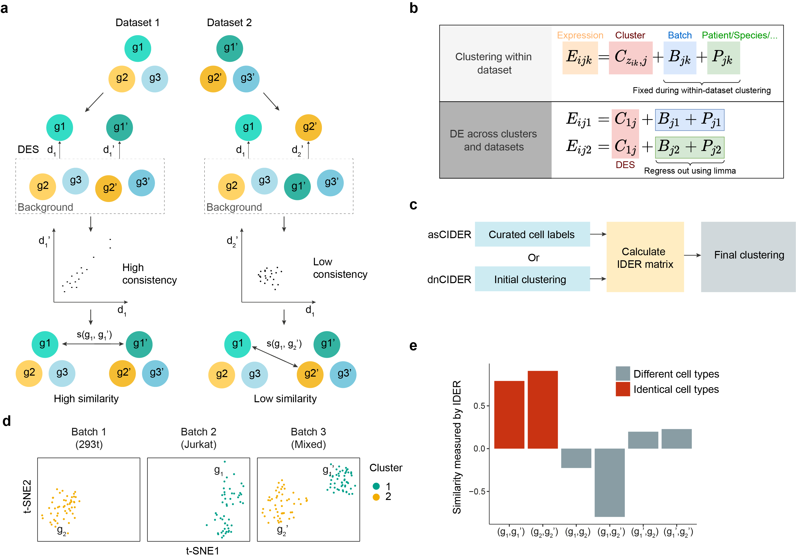

<!-- README.md is generated from README.Rmd. Please edit that file -->

```{r, include = FALSE}
knitr::opts_chunk$set(
  collapse = TRUE,
  comment = "#>",
  fig.path = "man/figures/README-",
  out.width = "100%"
)
```

# CIDER: Meta-Clustering for Single-Cell Data Integration and Evaluation

<!-- badges: start -->
<!-- badges: end -->

[](https://zenodo.org/badge/latestdoi/296897483)

Clustering Single-cell RNA-Seq (scRNA-Seq) data from multiple samples or conditions are often challenged by confounding factors, such as batch effects and biologically relevant variability. Existing batch effect removal methods typically require strong assumptions on the composition of cell populations being near identical across samples. Here we present **CIDER**, a **meta-clustering workflow** based on inter-group similarity measures. The prototype of this method is firstly applied in [Hu et al., Cancer Cell 2020](https://www.sciencedirect.com/science/article/pii/S1535610820300428).

**For more informtion please see our [publication](https://genomebiology.biomedcentral.com/articles/10.1186/s13059-021-02561-2) on Genome Biology (2021).** The published version and new citation information will be available soon.


CIDER can:

1. address the **clustering** task for confounded scRNA-Seq data, or
1. assess the biological correctness of integration as **a test metric**, while it does **not** require the existence of prior cellular annotations, or
1. compute the similarity among biological populations.

<!-- ## Installation -->

<!-- You can install CIDER from [CRAN](https://CRAN.R-project.org/package=CIDER) with: -->

<!-- ``` r -->
<!-- install.packages("CIDER") -->
<!-- ``` -->

## Installation (archived versions)

Archived versions of CIDER are available on [cran Archive](https://cran.r-project.org/src/contrib/Archive/CIDER/).

First you can download the package to a local folder and then install it from the file

```r
## replace the "path_to_pkg" with the real path
install.packages("path_to_pkg/CIDER_0.99.1.tar.gz", repos = NULL, type = "source")
```

We are working on the compatibility to bring our package back to cran.

## Compatibility

**Seurat**: currently our package only supports the old version Seurat, but not the Seurat v5. We are working to resolve the issue.


## CIDER as an evaluation metric - Quick start

If you have scRNA-Seq data corrected by an integration algorithm (e.g. Seurat-CCA, Harmony, Scanrama...). You can use CIDER to evaluate if the biological populations are correctly aligned.

Before running CIDER evaluation functions, make sure that you have a Seurat object (e.g. `seu.integrated`) with corrected PCs in `seu.integrated@reductions$pca@cell.embeddings`. Seurat-CCA automatically put the corrected PCs there. If other methods are used, the corrected PCs can be added using `seu.integrated@reductions$pca@cell.embeddings <- corrected.PCs`.

```r
library(CIDER)
seu.integrated <- hdbscan.seurat(seu.integrated)
ider <- getIDEr(seu.integrated, verbose = FALSE)
seu.integrated <- estimateProb(seu.integrated, ider)
```

The evaluation scores (IDER-based similarity and empirical p values) can be visualised by the `scatterPlot` function. A [detailed tutorial of evaluation](https://zhiyhu.github.io/CIDER/articles/evaluation.html) is available.

```r
p1 <- scatterPlot(seu.integrated, "tsne", colour.by = "similarity")
p2 <- scatterPlot(seu.integrated, "tsne", colour.by = "pvalue") 
plot_grid(p1,p2, ncol = 3)
```


## Use CIDER for clustering tasks

<!--- --->


### Quick start - asCIDER

Here `seu` is a Seurat object with initial clustering annotation stored in `initial_cluster` of metadata and batch information in `Batch`. The asCIDER example here contains two steps: computing IDER-based similarity matrix (`getIDER`) and performing the final clustering (`finalClustering`).

```r
ider <- getIDEr(seu, 
                group.by.var = "initial_cluster",
                batch.by.var = "Batch")
seu <- finalClustering(seu, ider, cutree.h = 0.45)
```

A detailed tutorial of asCIDER is [here](https://zhiyhu.github.io/CIDER/articles/asCIDER.html). If your data do not have prior batch-specific clusters, the dnCDIER tutorials ([high-level](https://zhiyhu.github.io/CIDER/articles/dnCIDER_highlevel.html) and [detailed walk-through](https://zhiyhu.github.io/CIDER/articles/dnCIDER.html)) can be referred to.


## Quick start - compute the similarity matrix within one batch

Here is the code used to compute the similarity matrix within one batch. 

```r
library(CIDER)
# make sure have a colume called "Batch" in the data and assign a uniform value
# to all cells, for example:
seu$Batch <- "onebatch" 
# run the getDistMat, the input needs to be list(seu), the tmp.initial.clusters 
# is the group information that you want to compute the similarity matrix with.
# The output is the similarity matrix.
dist <- getDistMat(seu_list = list(seu), tmp.initial.clusters = "cell_type")
```

A more dedicated function is under construction.

<!--- You'll still need to render `README.Rmd` regularly, to keep `README.md` up-to-date. `devtools::build_readme()` is handy for this. You could also use GitHub Actions to re-render `README.Rmd` every time you push. An example workflow can be found here: <https://github.com/r-lib/actions/tree/master/examples>.--->


## Bug reports and issues

Please use [Issues](https://github.com/zhiyhu/CIDER/issues) to report bugs or
seek help. Thank you!

## Citation

Z. Hu, A. A. Ahmed, C. Yau. CIDER: an interpretable meta-clustering framework for single-cell RNA-seq data integration and evaluation. *Genome Biology*
22, Article number: 337 (2021); [doi:
https://doi.org/10.1186/s13059-021-02561-2](https://doi.org/10.1186/s13059-021-02561-2)


